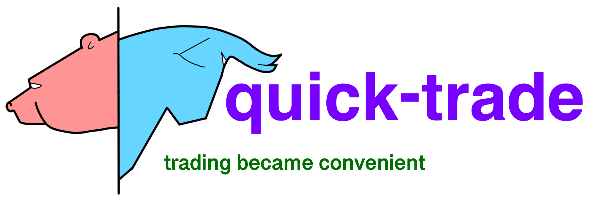

# quick_trade
VIEW DOCUMENTATION: https://vladkochetov007.github.io/quick_trade.github.io



```
used:
 ├──ta by Darío López Padial (Bukosabino   https://github.com/bukosabino/ta)
 ├──tensorflow==2.2 (https://github.com/tensorflow/tensorflow)
 ├──pykalman (https://github.com/pykalman/pykalman)
 ├──plotly (https://github.com/plotly/plotly.py)
 ├──scipy (https://github.com/scipy/scipy)
 ├──logging
 ├──pandas (https://github.com/pandas-dev/pandas)
 ├──numpy (https://github.com/numpy/numpy)
 ├──itertools
 ├──datetime
 ├──os
 ├──scipy
 └──iexfinance (https://github.com/addisonlynch/iexfinance)
```

algo-trading system.
trading with python.


## customize your strategy!

```
from quick_trade.trading_sys import PatternFinder
import yfinance as yf

class my_trader(PatternFinder):
    def strategy_buy_and_hold(
            self):
        ret = []
        for i in self.df['Close'].values:
            ret.append(1)
        self.returns = ret
        return ret


a = my_trader('MSFT', df=yf.download('MSFT', start='2019-01-01'))
a.set_pyplot()
a.strategy_buy_and_hold()
a.backtest()
```
*

1 -- Buy

2 -- Exit

0 -- Sell

*
## installing:
```
$ git clone https://github.com/VladKochetov007/quick_trade.git
```
or
```
$ pip install --upgrade quick-trade
```


## your project tree:
```
project
 ├── quick_trade
 │    ├── quick_trade
 |    |    ├── model-predicting
 |    |    │    ├── assets
 |    |    │    ├── varibles
 |    |    │    │    ├── varibles.data-00000-of-00001
 |    |    │    │    └── varibles.index
 |    |    │    └── saved_model.pb
 |    |    ├── model-regression
 |    |    │    ├── assets
 |    |    │    ├── varibles
 |    |    │    │    ├── varibles.data-00000-of-00001
 |    |    │    │    └── varibles.index
 |    |    │    └── saved_model.pb
 │    │    ├── trading_sys.py
 │    │    └── utils.py
 │    ├── LICENSE.md
 │    ├── .gitignore
 │    ├── logo.PNG
 │    ├── logo-with-slogan.PNG
 │    ├── README_for_pypi.txt
 │    ├── README.md
 │    ├── requerments.txt
 │    └── setup.py
 └── user_code.py
```

#### user_code example:
```
import quick_trade.trading_sys as qt
import yfinance as yf
a = qt.PatternFinder('AAPL', df=yf.download('AAPL', period='1y'))
a.set_pyplot()
a.strategy_macd()
a.backtest()
```

## output plot:
<div align="left">
  
</div>


<a rel="license" href="http://creativecommons.org/licenses/by-sa/4.0/">

</a><br/>
<span xmlns:dct="http://purl.org/dc/terms/" property="dct:title">quick_trade</span> by 
<a xmlns:cc="http://creativecommons.org/ns#"
href="https://github.com/VladKochetov007" property="cc:attributionName"
rel="cc:attributionURL">Vlad Kochetov</a> is licensed under a <a rel="license"
href="http://creativecommons.org/licenses/by-sa/4.0/">
Creative Commons Attribution-ShareAlike 4.0 International License</a>.
<br />Based on a work at 
<a xmlns:dct="http://purl.org/dc/terms/"
href="https://github.com/VladKochetov007/quick_trade"
rel="dct:source">https://github.com/VladKochetov007/quick_trade</a>.
<br />Permissions beyond the scope of this license may be available at 
<a xmlns:cc="http://creativecommons.org/ns#"
href="vladyslavdrrragonkoch@gmail.com" 
rel="cc:morePermissions">vladyslavdrrragonkoch@gmail.com</a>.
